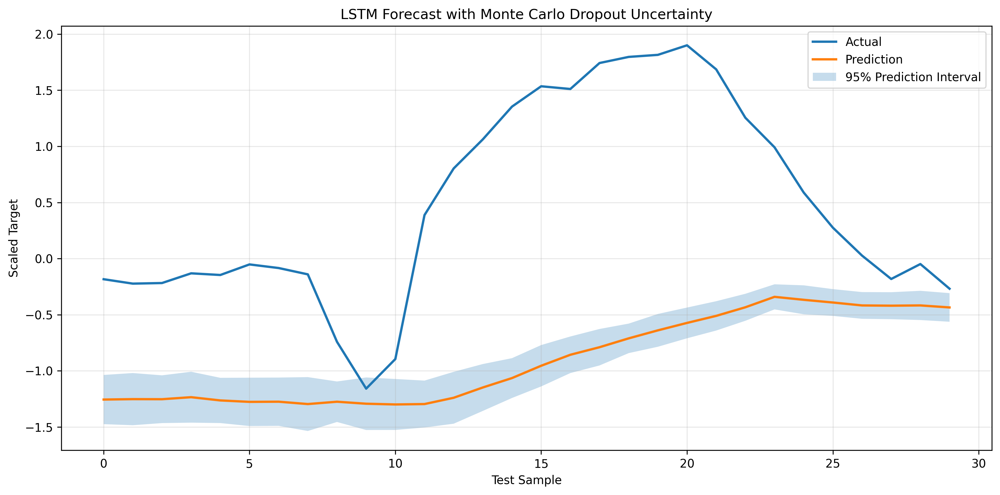
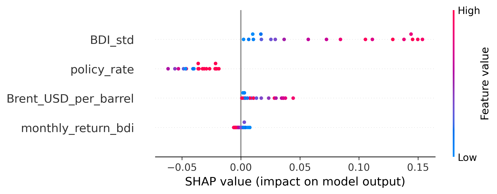

# 🇧🇼 Economic Intelligence Framework for Food Inflation Forecasting in Botswana

> **Deep Learning IndabaX Botswana 2026 Hackathon**
> Repository for the **Polyglot Pioneers** team.

<p align="center">


</p>

<p align="center">


</p>

---

# 📖 Project Overview

The **Economic Intelligence Framework** is an end-to-end forecasting system developed for the **Deep Learning IndabaX Botswana 2026 Hackathon**.

The framework integrates heterogeneous macroeconomic datasets into a unified analytical pipeline that forecasts Botswana's monthly food inflation using both a **Seasonal AutoRegressive Integrated Moving Average with eXogenous Variables (SARIMAX)** model and a **Long Short-Term Memory (LSTM)** neural network.

Beyond forecasting, the framework incorporates:

- 📊 Cross-dataset feature engineering
- 📈 Time-series forecasting
- 🔍 Explainable Artificial Intelligence (SHAP)
- 📉 Predictive uncertainty using Monte Carlo Dropout
- 🇧🇼 Decision-support for Botswana's food inflation

The project demonstrates how classical statistical modelling and deep learning can be combined within a transparent, reproducible Economic Intelligence Framework.

---

# 🚀 Key Features

- 🇧🇼 Botswana-focused food inflation forecasting
- 📊 Multi-source economic data integration
- 📈 Classical statistical forecasting using SARIMAX
- 🧠 Deep learning forecasting using LSTM
- 🔍 Explainable AI using SHAP
- 📉 Monte Carlo Dropout uncertainty estimation
- 📦 Automated preprocessing pipeline
- 🔄 Reproducible forecasting workflow
- 📁 Competition-ready prediction generation

---

# 🏗 System Architecture

```text
External Economic Datasets
│
▼
Data Integration
│
▼
Data Cleaning & Validation
│
▼
Feature Engineering
│
▼
Chronological Train / Validation / Test Split
│
┌──────┴────────┐
▼ ▼
SARIMAX LSTM
│ │
▼ ▼
Forecasts Monte Carlo Dropout
│
▼
SHAP Explainability
│
▼
Economic Intelligence Outputs
```

---

# 📂 Repository Structure

```text
.
├── Data_Raw/
├── Data_Clean/
├── notebooks/
├── src/
│ ├── config/
│ ├── data/
│ ├── explainability/
│ ├── features/
│ ├── models/
│ ├── scenarios/
│ └── utils/
│
├── models/
│ ├── checkpoints/
│ ├── explainability/
│ ├── figures/
│ └── training_history.json
│
├── Predictions/
├── logs/
├── README.md
└── requirements.txt
```

---

# 📊 Datasets

The forecasting framework integrates five independent economic datasets.

| Dataset | Purpose |
|----------|---------|
| FAO Food Price Indices | Food price indicators and forecasting target |
| Baltic Dry Index | International shipping market conditions |
| Brent Crude Oil Prices | Global energy markets |
| Botswana Policy Rate | Domestic monetary policy |
| Human Capital Project | Long-term socioeconomic analysis |

The Human Capital Project dataset is analysed separately from the forecasting models because its annual reporting frequency is incompatible with monthly forecasting.

---

# ⚙️ Feature Engineering

The forecasting pipeline performs extensive feature engineering before model training.

Major stages include:

- Cross-dataset integration
- Temporal harmonisation
- Daily-to-monthly Baltic Dry Index aggregation
- Chronological data validation
- Chronological train/validation/test splitting
- Feature scaling
- Sliding-window sequence generation
- Prediction dataset generation

The final forecasting models use four engineered predictor variables:

- **BDI_std**
- **monthly_return_bdi**
- **Brent_USD_per_barrel**
- **policy_rate**

These variables capture complementary aspects of international trade, transportation costs, energy markets and domestic monetary policy.

---

# 🎯 Prediction Target

The forecasting target is

```text
FAO_23014
```

representing Botswana's monthly Food Price Index.

---

# 🤖 Forecasting Models

## Classical Statistical Model — SARIMAX

The statistical benchmark model captures:

- Seasonal patterns
- Temporal autocorrelation
- Trend
- Exogenous macroeconomic variables

SARIMAX provides an interpretable baseline for evaluating forecasting performance.

The code for the SARIMAX model can be found in the Model_1_Classical Jupyter notebook. Before running this notebook, clean and merge the datasets using the Data Cleaning notebook. Replace the file paths with your own to run the code in your local computer. The food price inflation, Baltic Dry Index, Brent Crude Oil prices and policy rate datasets are cleaned and merged together. However, the Human Capital Project dataset is not merged to these 4 datasets and it is instead merged with external data and analysed separately. After merging the 4 datasets, save the final data as a dataset called "prediction_data" to the Data_Clean folder. After this step, load the "prediction_data.csv" file in the "Model_1_Classical" notebook and start the analysis. Remember to replace the file paths with your own to run the code in your local computer. 

After determing the ARIMA order in the later stages, the model equation used to forecast the fod price inflation is as follows. Even though the final ARIMA order is ARIMA(0, 1, 2), we do not difference the dependent variable as SARIMAX handles differencing internally:

<p align="center">


<br><br>


<br><br>


</p>

The terms in the model equation are as follows: Food price inflation, Baltic Dry Index (lag 0 and lag 7), Policy Rate (lag 12), Brent Crude Oil prices (lag 16), seasonality dummy variables (month_2 to month_12), structural break dummy variables for 2009 and 2022, and the error term.

It has been established that the SARIMAX model outperforms the LSTM deep learning model, so the final predictions for SARIMAX are saved as "best_model_predictions.csv" to the "Predictions" folder.

The pipeline for processing and analysing data for the SARIMAX process is as follows:

```text
Data Cleaning and Inspection
        │
        ▼
Exploratory plots (time series and lowess plots)
        │
        ▼
Test for seasonality and structural breaks
        │
        ▼
Creation of seasonality and structural break dummy variable
        │
        ▼
Test for stationarity
        │
        ▼
Pearson correlation test
        │
        ▼
Determine lag structures (Cross-Correlation Function plots)
        │
        ▼
Create lagged predictors
        │
        ▼
Granger Causality test
        │
        ▼
Check for multicollinearity (Variance Inflation Factor test)
        │
        ▼
Determine ARIMA order
        │
        ▼
Fit model
        │
        ▼
Forecast exogenous variables
        │
        ▼
Forecast dependent variable (food price inflation)
        │
        ▼
Determine confidence intervals
        │
        ▼
Plot forecast against historical values
        │
        ▼
Evaluate model (RMSE, MAE, sMAPE and R-squared)
        │
        ▼
Export predictions
```
---

## Deep Learning Model — LSTM

The LSTM model learns temporal dependencies directly from sequential observations.

### Architecture

| Parameter | Value |
|-----------|------:|
| Input Features | 4 |
| Sequence Length | 12 Months |
| Hidden Units | 64 |
| LSTM Layers | 2 |
| Dropout | 0.20 |

Training includes:

- Early Stopping
- Learning Rate Scheduling
- Checkpoint Saving
- Monte Carlo Dropout

---

# 🔍 Explainable AI

Model interpretability is provided through **SHAP (SHapley Additive exPlanations)**.

Generated explainability outputs include:

- Global feature importance
- Feature contribution analysis
- SHAP summary plots

---

# 📉 Uncertainty Quantification

Prediction uncertainty is estimated using **Monte Carlo Dropout**.

Outputs include:

- Predictive mean
- Predictive standard deviation
- 95% confidence intervals
- 95% prediction intervals

---

# ⚙️ Training Pipeline

The end-to-end forecasting pipeline performs:

1. Data loading
2. Dataset validation
3. Feature engineering
4. Feature scaling
5. Chronological data splitting
6. Sequence generation
7. LSTM training
8. Model evaluation
9. Monte Carlo Dropout
10. SHAP explainability
11. Prediction generation

---

# 🛠 Technologies

| Technology | Purpose |
|------------|---------|
| Python | Core programming language |
| PyTorch | Deep learning |
| Statsmodels | SARIMAX forecasting |
| Scikit-learn | Preprocessing & evaluation |
| Pandas | Data manipulation |
| NumPy | Numerical computing |
| Matplotlib | Visualisation |
| SHAP | Explainable AI |

---

# 📦 Installation

```bash
git clone https://github.com/GorataB/Hackathon_PolyglotPioneers.git

cd Hackathon_PolyglotPioneers

python -m venv .venv

# Windows
.venv\Scripts\activate

# macOS / Linux
source .venv/bin/activate

pip install -r requirements.txt
```

---

# ▶️ Running the Pipeline

```bash
python -m src.deep_learning_train
```

---

# 🔄 Training From Scratch

If previous checkpoints exist, delete them before retraining.

Linux / macOS

```bash
rm models/checkpoints/*.pth
```

Windows PowerShell

```powershell
Remove-Item models\checkpoints\*.pth
```

Then run

```bash
python -m src.deep_learning_train
```

---

# 📊 Generated Outputs

```text
models/
│
├── checkpoints/
├── explainability/
│ └── shap_summary.png
│
├── figures/
│ └── uncertainty_forecast.png
│
└── training_history.json

Predictions/
├── predictions.csv
├── lstm_predictions.csv
└── stats_model_predictions.csv

logs/
└── forecasting_pipeline.log
```

---

# 📊 Results and Visualisations

The forecasting pipeline automatically generates several visual outputs that support model evaluation, explainability, and uncertainty analysis.

| Output | Description |
|---------|-------------|
| 📈 **uncertainty_forecast.png** | Forecasts with 95% confidence and prediction intervals generated using Monte Carlo Dropout. |
| 📊 **shap_summary.png** | SHAP feature importance plot showing each predictor's contribution to the LSTM forecasts. |

<p align="center">



<br><br>



</p>

---

# 🔄 Reproducibility

The forecasting framework has been designed for reproducible experimentation.

Key reproducibility features include:

- Deterministic preprocessing
- Chronological train/validation/test split
- Saved preprocessing scalers
- Saved checkpoints
- Automated prediction generation
- Logging throughout the pipeline
- Modular project structure

---

# 📈 Future Work

Potential future improvements include:

- Temporal Fusion Transformers
- GRU architectures
- Temporal Convolutional Networks
- Additional macroeconomic indicators
- Policy scenario simulation
- Interactive dashboard
- Real-time forecasting

---

# 👥 Team

## Polyglot Pioneers

**Deep Learning IndabaX Botswana 2026 Hackathon**

---

# 🙏 Acknowledgements

- Deep Learning IndabaX Botswana
- Startup Labs
- VenturePulse
- Food and Agriculture Organization (FAO)
- Bank of Botswana
- Baltic Exchange
- World Bank Human Capital Project
- Open-source Python community

---

# 📄 License

This project is released under the MIT License.

---

<p align="center">
Built with ❤️ by <strong>Polyglot Pioneers</strong><br>
for the <strong>Deep Learning IndabaX Botswana 2026 Hackathon</strong>
</p>
